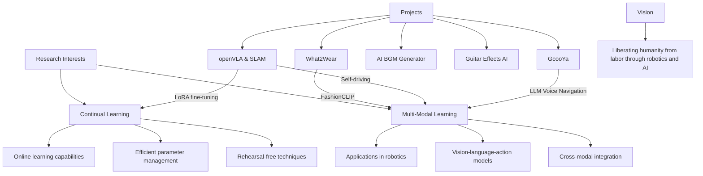

# YunYoung Lee 👋

  
  

  ### *"Problem Solving and Challenges"*
  
  
  
  

## 🧑‍💻 About Me

Hello! I'm Yunyoung Lee, a Physics and Software Technology & Entrepreneurship major at Korea University.

- 🎯 I center my life around **problem solving** and the **spirit of challenge**
- 🤖 My goal is to **liberate humanity from labor** through robotics and artificial intelligence
- 🧠 I'm actively researching **Continual Learning** and **Multi Modal** fields with special interest
- 🔍 I enjoy the process of defining new problems and solving them with creative approaches
- 🚀 I embrace a proactive approach that anticipates and prepares for the future

## 🛠️ Tech Stack

### Languages

  

### Libraries & Frameworks

  
  
  
  
  
  

### Tools

  
  
  
  
  
  
  
  
  

## 📊 GitHub Stats

  

## 🔬 Research Interests & Projects

## 🚀 Notable Projects

### 👕 [What2Wear](https://github.com/yunyounglee99/What2Wear)
AI 기반 의류 추천 시스템으로, FashionCLIP을 활용하여 개발한 새로운 모델입니다. 전체적인 아웃핏을 이해하고 사용자가 선택한 의류 아이템에 맞게 잘 어울리는 다른 카테고리의 의류 아이템을 추천합니다.
- 교내 인공지능 모델 개발 및 사업화 대회 **3등 수상**
- 새로운 Matching Loss 개념 제안
- 라벨링/유저 데이터 없이 outfit 이미지만으로 추천 가능

### 🎵 [BGen : AI 기반 BGM 생성기](https://github.com/yunyounglee99/BGen)
영상의 특정 구간에 어울리는 BGM을 자동으로 생성해주는 프로젝트입니다.
- Twelve Labs API를 통한 영상 내용 이해
- Meta의 AudioCraft API를 활용한 맞춤형 음악 생성
- 저작권 문제 해결 및 크리에이터 워크플로우 개선

### 🎸 기타 오디오 이펙트 변환 AI
CNN과 GANsynth를 활용하여 기타 오디오 이펙트를 분류하고 새로운 이펙트를 생성하는 프로젝트입니다.
- 복잡한 알고리즘 없이 딥러닝만으로 기타 사운드 이펙트 적용
- STFT 처리 및 오디오 데이터 분석

### 🛴 GcooYa
Personal Mobility의 사회적 인식 개선을 위한 LLM 기반 음성 상호작용 내비게이션 서비스입니다.
- 해커톤 챌린지 **3등 수상**
- 팀 내 갈등 해결 및 통합적 방향성 제시

## 📚 Current Research

### [CSAE (Continual Sparse AutoEncoder)](https://github.com/yunyounglee99/CSAE)
Rehearsal-free continual learning에서 모델 구조 개선 및 성능 향상을 위한 연구입니다.
- Topk gating을 활용한 SAE 병렬 연결
- Task 추가 시 parameter 증가 방지
- Delta interpolation과 learnable alpha 도입

## 🎓 Education

- **Korea Univ.** | Physics & Software Technology & Entrepreneurship | undergraduate

## 👨‍💻 I'm currently focusing on...

- 💡 Research in Continual Learning and Multi-Modal systems
- 🤖 Integration strategies for robotics and artificial intelligence

  
  
  

