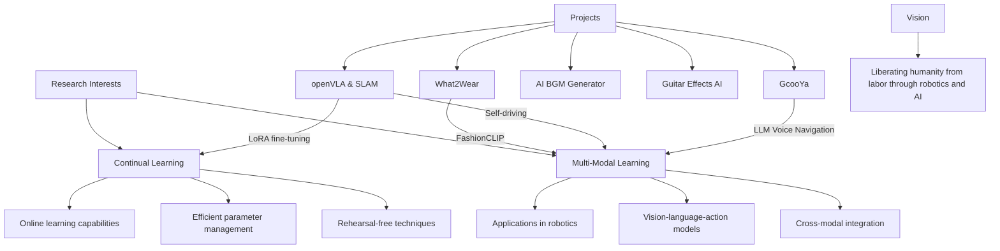

# YunYoung Lee 👋

  
  

  ### *"Problem Solving and Challenges"*
  
  
  
  

## 🧑‍💻 About Me

Hello! I'm Yunyoung Lee, a Physics and Software Technology & Entrepreneurship major at Korea University.

- 🎯 I center my life around **problem solving** and the **spirit of challenge**
- 🤖 My goal is to **liberate humanity from labor** through robotics and artificial intelligence
- 🧠 I'm actively researching **Continual Learning** and **Multi Modal** fields with special interest
- 🔍 I enjoy the process of defining new problems and solving them with creative approaches
- 🚀 I embrace a proactive approach that anticipates and prepares for the future
- 🐞 And I am a Bugslayer Supreme...!

## 🛠️ Tech Stack

### Languages

  
  

### Libraries & Frameworks

  
  
  
  
  
  
  

### Tools

  
  
  
  
  
  
  
  
  
  
  

## 📊 GitHub Stats

  

## 🔬 Research Interests & Projects

## 📚 Current Research

### [CSAE (Continual Sparse AutoEncoder)](https://github.com/yunyounglee99/CSAE)
Research on enhancing model architecture and performance in rehearsal-free continual learning. 
- Parallel integration of a Sparse AutoEncoder using top-k gating  
- Prevents parameter growth when adding new tasks  
- Introduces delta interpolation with a learnable α gate  

## 🚀 Notable Projects

### 👕 [What2Wear](https://github.com/yunyounglee99/What2Wear)
An AI-driven clothing recommendation system built on FashionCLIP that understands full outfits and suggests complementary items based on a user-selected garment.  
- 3rd place in university AI model development & commercialization competition 
- Proposed a novel Matching Loss formulation  
- Generates outfit recommendations from unlabeled images without user history  

### ☀️ [Solar Magnetic Field Prediction with Neural ODE](https://github.com/yunyounglee99/Solar_Flare_Prediction-neuralODE)  
A project applying Neural ODEs to forecast the continuous dynamics of the solar magnetic field components ($B_x$, $B_y$, $B_z$).  
- Models instantaneous magnetic field changes with a convolutional ODE function and Dormand–Prince solver    
- Enhances physical consistency by combining MSE with a boundary-condition (divergence) loss  
-  Handles irregular time series and reduces memory footprint via `torchdiffeq`’s adaptive solver and adjoint method  

### ☘️ [Puripuri](https://github.com/yunyounglee99/puripuri)
An AI hint system that supports students solving math problems by generating context-aware hints.  
- OCR of student handwritten work using the Mathpix API  
- Next-step hint generation via OpenAI ChatGPT API  
- Encourages active learning by guiding student thought processes

### 🎵 [BGen : AI-driven BGM Generator](https://github.com/yunyounglee99/BGen)
Automatically generates background music suited to specific video segments.  
- Analyzes video content with the Twelve Labs API  
- Produces custom music tracks using Meta’s AudioCraft API  
- Addresses copyright concerns and streamlines creator workflows  

## 🎓 Education

- **Korea Univ.** | Physics, Software Technology & Entrepreneurship | undergraduate

## 👨‍💻 I'm currently focusing on...

- 💡 Research in Continual Learning and Multi-Modal systems
- 🤖 Integration strategies for robotics and artificial intelligence

  
  
  

